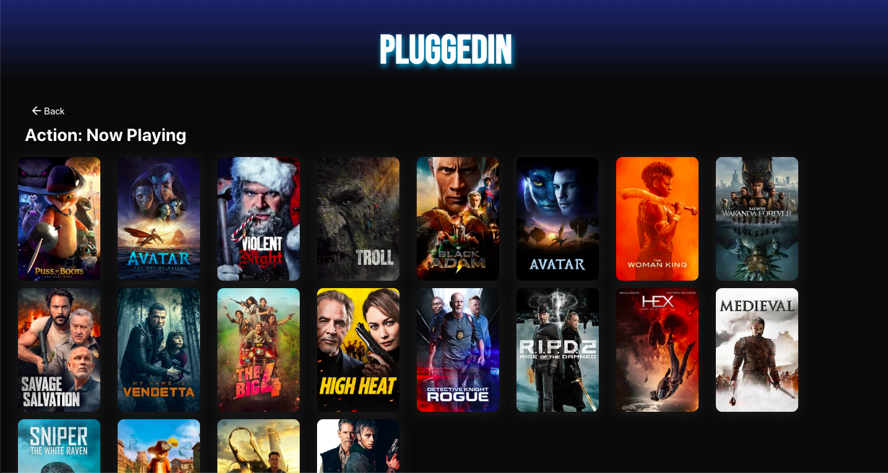
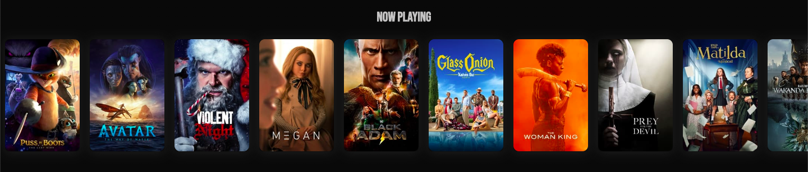

# PluggedIn

PluggedIn is an app that displays updated movie information using TMDB's API. Users can search for a movie to view it's general information such as description, rating, and release date. Users can  filter through movies by genre and categories, which are constantly updating. Built using React, React Router, HTML, CSS, and TMDB API.
/n
/n
Before running this application, please visit <a href='https://cors-anywhere.herokuapp.com/corsdemo'>this link</a> and allow temporary access to the server.

## Features

* Search for a movie by typing in a key word.
* Search for movies by category.
* Search for movies by genre.
* View general information about the movie such as the title, description, rating, and release date.

## Final Product

#### <h3>Homepage;</h3>

#### <h3>Search for a movie</h3>

#### <h3>View movies by genre:</h3>

#### <h3>Click on a movie to view it's details:</h3>

#### <h3>View movies by category:</h3>

## Getting Started

In the project directory, you can run:

### `npm install`
Installs all the dependencies required for the app to run.

### `npm start`

Runs the app in the development mode.
Open [http://localhost:3000](http://localhost:3000) to view it in your browser.

